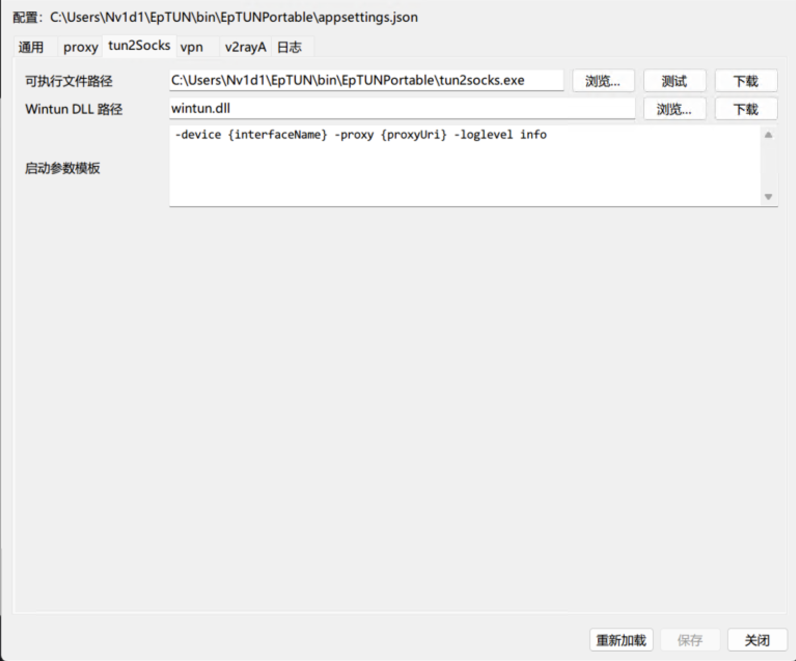
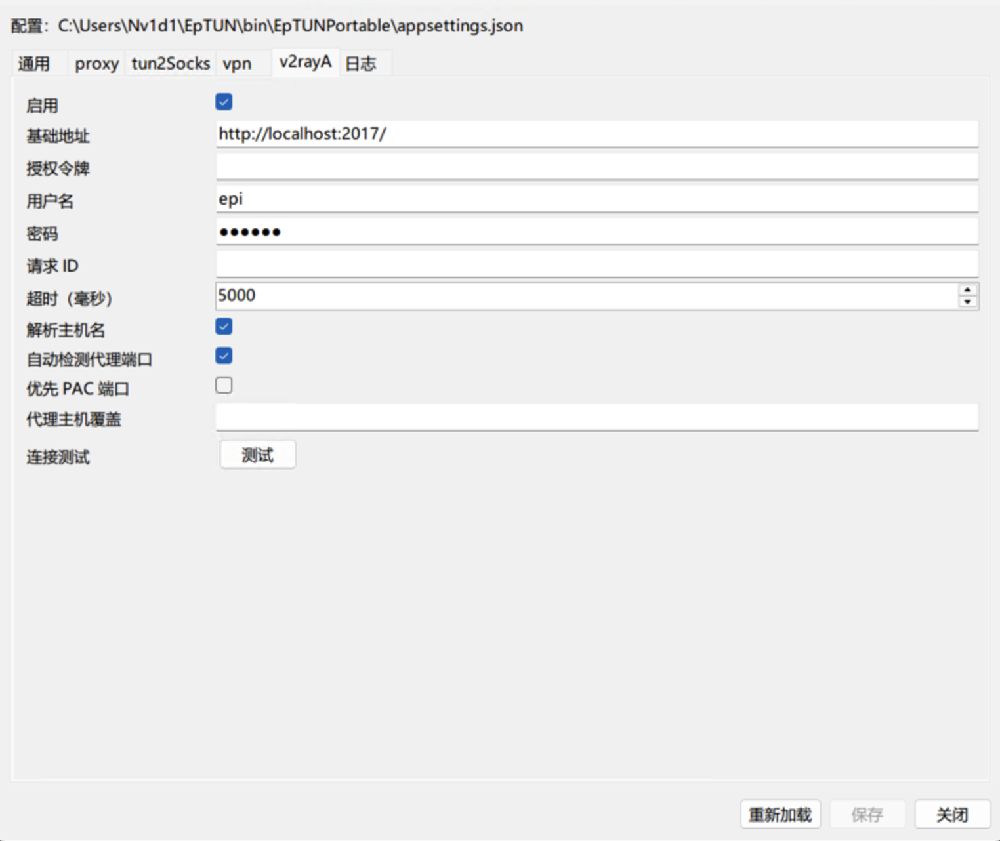
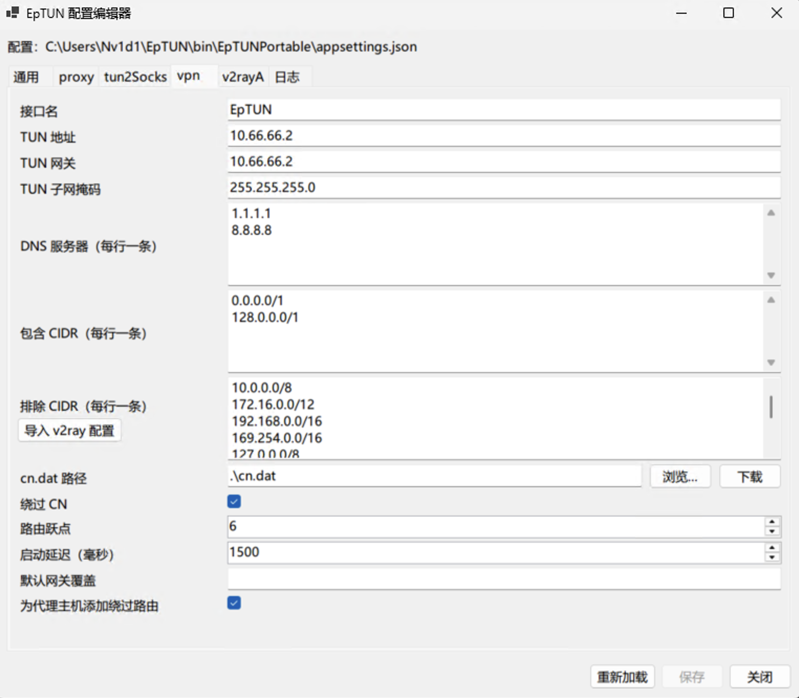

= EpTUN 白话文指北 (v2rayA)
:toc:
:toclevels: 3
:sectnums:

这篇是给第一次用 EpTUN 的人写的，目标只有一个：用你手里的节点/订阅，把 Windows 的系统流量交给代理。

== 先说人话：EpTUN 到底干嘛的？

EpTUN 本身**不是**“节点客户端”，它不会直接吃 `vless://` 以及订阅链接。

它做的是另一件事：把系统流量导到 TUN，再转给一个“本地代理端口”（比如 `socks5://127.0.0.1:10810`）。

所以流程一定是：

1. 先在 v2rayA 把 `vless://` 或者订阅出的节点跑起来（本地开一个 socks5 端口）。
2. 再让 EpTUN 接管系统流量，转发到这个端口。

== 准备清单（缺一不可）

1. Windows 10/11（可正常弹出并同意 UAC 授权窗口）。
2. EpTUN 程序目录（至少有 `EpTUN.exe`、`appsettings.json`）。
3. `tun2socks.exe` 和 `wintun.dll`（放到和 `EpTUN.exe` 同目录）。
4. v2rayA（Web 管理地址默认是 `http://127.0.0.1:2017`）。

目录建议长这样：

[source,text]
----
EpTUN/
  EpTUN.exe
  appsettings.json
  tun2socks.exe
  wintun.dll
  cn.dat           (可选，用于国内网段直连)
----

== 名词白话翻译（比喻版）

[cols="1,2,3",options="header"]
|===
|名词 |白话解释 |打个比方

|`vless://` 节点链接
|一串“连哪个服务器、用什么参数”的说明书。
|像外卖地址单，告诉骑手去哪、怎么进小区。

|v2rayA
|负责把节点真正跑起来的“发动机控制台”。
|像汽车仪表台，点火、切挡、看状态都在这。

|本地 `socks5` 端口
|本机上的代理入口（例：`127.0.0.1:10810`）。
|像小区门岗，所有要出门的数据先在这里登记。

|TUN 网卡
|系统里的虚拟网卡，专门接管流量。
|像临时修的一条专用车道，把车先引过去。

|`tun2socks`
|把 TUN 里的流量翻译成 socks/http 代理能吃的格式。
|像同声传译，把甲方语言翻成乙方能听懂的语言。

|`includeCidrs`
|哪些网段“必须进代理车道”。
|像收费站白名单：这些车必须进这条道。

|`excludeCidrs`
|哪些网段“不走代理，直接放行”。
|像小区内部道路，内部车直接走近路。

|`bypassCn`
|自动把国内网段加入直连。
|像给本地快递开绿色通道，不绕远路。

|`routeMetric`
|路由优先级，数字越小越优先。
|像窗口叫号，号码小的先办。
|===

== 第一步：安装并登录 v2rayA

=== 1) 安装

按你指定的 release 页面安装：

1. 打开：`https://github.com/v2rayA/v2rayA/releases/latest`
2. 展开 `Assets`。
3. 按系统架构下载对应安装包：
4. 常见 64 位 Windows 下载 `installer_windows_inno_x64_*.exe`
5. ARM 设备下载 `installer_windows_inno_arm64_*.exe`
6. 双击 `.exe` 按安装向导完成安装。

注意：

1. `v2raya_windows_x64_*.exe` / `v2raya_windows_arm64_*.exe` 是 CLI 二进制，不是图形安装器。
2. Windows 新手请优先用 `installer_windows_inno_*` 前缀的安装包。

可选但推荐：

1. 同时下载同名 `.sha256.txt` 文件。
2. 用哈希校验确认安装包完整性后再安装。

=== 2) 打开管理页并登录

浏览器访问 `http://127.0.0.1:2017`，按页面提示完成首次登录。

登录成功后，顶栏会看到状态文字（如 `正在运行`/`就绪`）。

== 第二步：按网页界面导入节点（你当前界面可直接照着点）

=== 1) 导入链接

1. 点顶部的 `导入` 按钮。
2. 在弹窗 `填入节点链接或订阅地址：` 输入框粘贴你手里的 `vless://...` 或订阅链接。
3. 单条链接直接点 `确定`。
4. 多条链接一次导入时，先点 `批量` 再点 `确定`。

=== 2) 看导入结果在什么标签

导入后通常有两种情况：

1. 如果是订阅地址，会在 `SUBSCRIPTION` 标签出现一行记录。
2. 如果是单节点，通常会在 `SERVER` 标签出现。

=== 3) 如果是订阅，先更新一次

1. 打开 `SUBSCRIPTION` 标签。
2. 在对应订阅那一行点 `更新`。
3. 然后点该订阅别名对应的标签。
4. 进入节点列表后再选节点。

=== 4) 选一个可用节点

在节点列表（有 `节点名 / 节点地址 / 协议 / 操作` 这些列）里，点目标节点右侧 `选择`。

选中后，按钮通常会变成 `取消`，表示它已成为当前节点。

=== 5) 确认 PROXY 出站组

点顶栏 `PROXY`（下拉菜单）：

1. 确认当前选择的是你要用的出站组（如你实际在用的组）。
2. 新手阶段可保留默认组，避免过度学习导致行为不一致。

== 第三步：在 v2rayA 确认本地端口（给 EpTUN 用）

1. 点顶栏 `设置`。
2. 点底部 `地址与端口`。
3. 找 `socks5端口` 和 `http端口`。
4. 记下 `socks5端口`（你的界面当前是 `10810`）。

提示：

1. 不同机器端口可能不同，别死记 `10808/10810`。
2. 后面 EpTUN 的 `proxy.port` 必须和这里一致，或者启用 v2rayA 自动探测。

== 第四步：改 EpTUN 配置（纯 v2rayA 路线）

在第一个 tab 设置语言为中文后，这一段你可以按截图来，直接照着填就行。先改 `tun2Socks`、`v2rayA`、`vpn` 这 3 个页签，其他先别动。

=== A) `tun2Socks` 页签（先保证程序能跑起来）

1. `可执行文件路径`：指向你本机的 `tun2socks.exe`。
2. `Wintun DLL 路径`：填 `wintun.dll`（或它的完整路径）。
3. `启动参数模板`：建议保持默认 `-device {interfaceName} -proxy {proxyUri} -loglevel info`。

一句话理解：这页就是“EpTUN 要调用哪个转发程序”，路径对了就成功一半。

[NOTE] 通常来说，这些会和 `EpTUN.exe` 在同一个目录

=== B) `v2rayA` 页签（决定能不能连上代理）

1. `启用`：勾选。
2. `基础地址`：填 `http://localhost:2017/`（或 `http://127.0.0.1:2017`）。
3. `授权令牌` 和 `用户名/密码`：二选一，别都空。
4. `自动检测代理端口`：勾选（推荐）。
5. `优先 PAC 端口`：先不勾。
6. `代理主机覆盖`：先留空。
7. 可以点 `测试` 按钮做连通性检查。

一句话理解：这页就是“告诉 EpTUN 去哪里找 v2rayA，以及怎么登录”。

=== C) `vpn` 页签（新手先用默认最稳）

1. `接口名`、`TUN 地址`、`TUN 网关`、`TUN 子网掩码`：先按图保持默认。
2. `DNS 服务器`：`1.1.1.1` 和 `8.8.8.8` 保留。
3. `包含 CIDR`：保留 `0.0.0.0/1` 和 `128.0.0.0/1`（全局接管的关键）。
4. `排除 CIDR`：保留默认局域网/本地网段，别随便删。
5. `cn.dat 路径`：填 `.\cn.dat` 或完整路径。
6. `绕过 CN`：勾选时国内流量尽量直连，不勾就全走代理。
7. `路由跃点` 用 `6`、`启动延迟` 用 `1500`：先保持默认。
8. `默认网关覆盖`：留空。
9. `为代理主机添加绕过路由`：勾选。

一句话理解：这页控制“哪些流量走代理、哪些直连”，默认值已经是适合新手的稳妥方案。

=== D) 改完后只做两件事

1. 点 `保存`（如果有改动）。
2. 点 `重新加载`，然后再开始 `Start VPN`。

== 第五步：正确启动顺序（别反了）

1. 先确保 v2rayA 页面里目标节点已 `选择`，并且左上角状态明确显示 `正在运行`。
2. 正常启动 `EpTUN.exe`，出现 UAC 授权窗口时点 `是`。
3. 在 EpTUN 窗口/托盘里点 `Start VPN`（或你当前版本对应的启动按钮）。

停用时反过来：

1. 在 EpTUN 里点停止。
2. 确认路由恢复后，再停 v2rayA。

== 第六步：怎么判断成功了？

1. 先访问 `https://www.google.com`（或 `https://www.youtube.com`、`https://www.wikipedia.org`），能稳定打开。
2. 再访问一个国内站（如 `https://www.baidu.com`）确认本地网站仍可正常访问。
3. EpTUN 日志里没有 `Proxy endpoint is not reachable`。
4. v2rayA 的 `日志` 里持续出现 `accepted tcp` 且带你选中的节点名。
5. 开启 `bypassCn=true` 时，国内站通常走直连，国际站走代理。

== 常见报错对照表（小白救命区）

`Proxy endpoint is not reachable`::
先去 v2rayA 的 `设置 -> 地址与端口` 看 `socks5端口`，再对齐 `appsettings.json` 的 `proxy.port`；并确认 v2rayA 顶栏显示 `正在运行`。

`tun2socks exited early`::
大概率是 `tun2socks.exe` / `wintun.dll` 路径不对，或者被安全软件拦截。

`v2rayA /api/ports` 或 `/api/touch` 鉴权失败::
检查 `v2rayA.authorization`，或者 `username/password` 是否正确；`baseUrl` 对应地址是否真的可访问（例如在浏览器里能打开 `http://127.0.0.1:2017`）。

导入后节点列表是空的::
去 `SUBSCRIPTION` 标签先点该订阅行的 `更新`，更新完成后再点订阅别名标签查看节点。

选了节点但流量没走代理::
检查顶栏 `PROXY` 下拉是否切到正确出站组；再去 `日志` 看是否有该节点的 `accepted tcp` 记录。

启动后全网断流::
先停止 EpTUN；再检查是否已同意 UAC 授权窗口、`includeCidrs` 是否保留默认、本地代理是否可连接。

== 参考链接

1. v2rayA 官方安装文档: https://v2raya.org/en/docs/prologue/installation/
2. v2rayA GitHub Releases: https://github.com/v2rayA/v2rayA/releases
